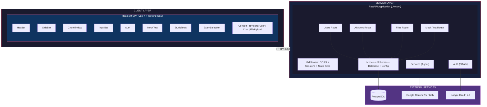
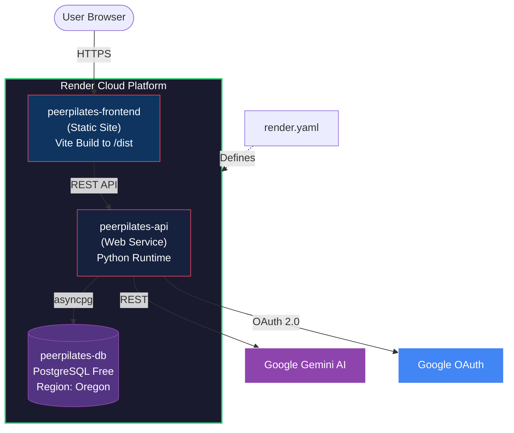
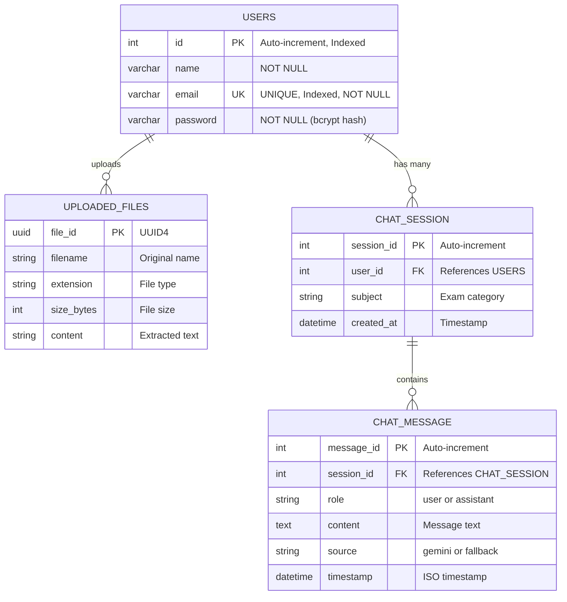
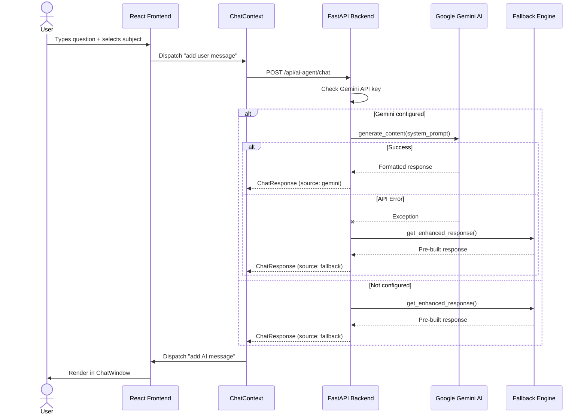
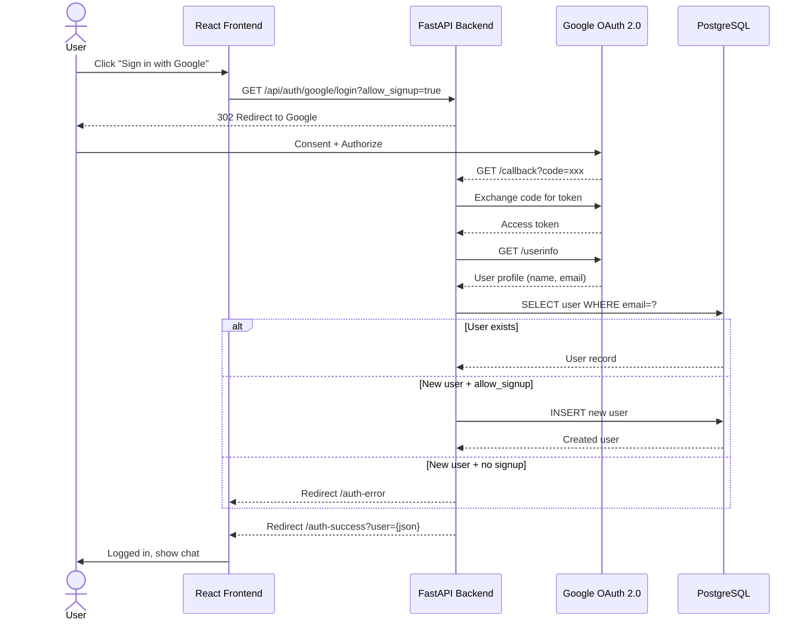
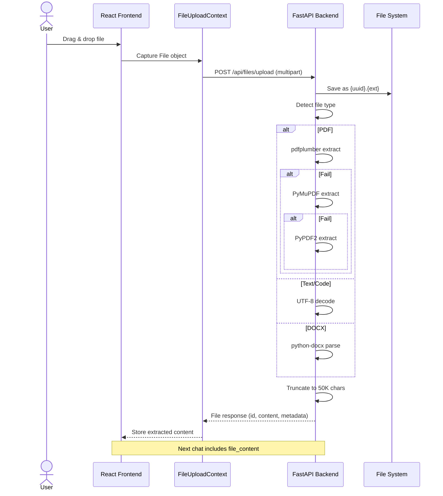

# Software Design Document (SDD)

## PeerPilates — AI-Powered Government Exam Preparation Platform

| Field               | Details                                                       |
|---------------------|---------------------------------------------------------------|
| **Document Version**| 1.0                                                           |
| **Date**            | May 2026                                                      |
| **Project Name**    | PeerPilates                                                   |
| **Architecture**    | Client-Server, Monorepo (Backend + Frontend)                  |
| **Backend**         | FastAPI (Python 3.11) — Asynchronous REST API                 |
| **Frontend**        | React 19 + Vite 7 — Single Page Application                  |
| **Database**        | PostgreSQL — Async via SQLAlchemy 2.0 + asyncpg               |
| **AI Engine**       | Google Gemini 2.5 Flash — Generative AI                       |

---

## 1. Introduction

### 1.1 Purpose
This Software Design Document describes the architecture, component design, data models, and technical implementation details of PeerPilates. It serves as a blueprint for developers and reviewers to understand how the system is constructed and how each component interacts.

### 1.2 Scope
The document covers:
- System architecture and deployment topology
- Backend module design (routes, models, services, auth)
- Frontend component hierarchy and state management
- Database schema and ORM mapping
- API contract specifications
- AI integration design with fallback strategies
- Security architecture
- Deployment pipeline

---

## 2. System Architecture

### 2.1 High-Level Architecture (Mermaid)



### 2.2 Deployment Architecture (Mermaid)



---

## 3. Backend Design

### 3.1 Directory Structure

```
app/
├── __init__.py              # Package initializer
├── main.py                  # FastAPI app entry point, middleware, route registration
├── config.py                # Environment variable loading (Settings class)
├── database.py              # Async SQLAlchemy engine + session factory
├── auth/
│   ├── __init__.py
│   ├── oauth.py             # Google OAuth client configuration (Authlib)
│   └── routes.py            # OAuth login, callback, status endpoints
├── models/
│   ├── __init__.py
│   └── user.py              # SQLAlchemy User model (ORM)
├── routes/
│   ├── __init__.py
│   ├── users.py             # Signup, login endpoints
│   ├── ai_agent.py          # AI chat + Gemini integration
│   ├── files.py             # File upload, processing, deletion
│   ├── mock_test.py         # Mock test paper generation
│   └── protected.py         # Protected route examples
├── schemas/
│   ├── __init__.py
│   └── user.py              # Pydantic validation schemas
└── services/
    └── agent.py             # AI service business logic
```

### 3.2 Module Descriptions

#### 3.2.1 `main.py` — Application Entry Point

| Responsibility             | Implementation                                         |
|----------------------------|--------------------------------------------------------|
| App initialization         | `FastAPI(title="PeerPilates API", version="1.0.0")`    |
| Session middleware         | `SessionMiddleware` with configurable secret key       |
| CORS configuration         | Whitelisted origins (localhost + production URL)        |
| Database table creation    | `@app.on_event("startup")` → `Base.metadata.create_all`|
| Route registration         | 6 routers: auth, users, ai_agent, protected, files, mock_test |
| Static file serving        | Serves frontend `/dist` in production mode             |
| SPA routing fallback       | Catch-all route serves `index.html` for client-side routing |

#### 3.2.2 `config.py` — Configuration Management

```python
class Settings:
    PROJECT_NAME = "PeerPilates"
    DATABASE_URL    # Auto-converts postgres:// → postgresql+asyncpg://
    BACKEND_URL     # Default: http://localhost:8000
    FRONTEND_URL    # Default: http://localhost:5173
    GOOGLE_CLIENT_ID
    GOOGLE_CLIENT_SECRET
    GEMINI_API_KEY
    SESSION_SECRET_KEY  # Auto-generated on Render
```

**Design Decision**: The `DATABASE_URL` auto-conversion handles Render's `postgres://` scheme which is incompatible with asyncpg, transparently converting it to `postgresql+asyncpg://`.

#### 3.2.3 `database.py` — Database Engine

| Parameter        | Value  | Rationale                                    |
|------------------|--------|----------------------------------------------|
| `pool_size`      | 5      | Baseline connections for normal load          |
| `max_overflow`   | 10     | Burst capacity for traffic spikes             |
| `pool_recycle`   | 300s   | Prevents stale connections (Render drops idle)|
| `pool_pre_ping`  | True   | Tests connection health before use            |
| `pool_timeout`   | 30s    | Max wait for available connection             |

#### 3.2.4 `routes/users.py` — User Management

**Signup Flow:**
```
Client POST /api/signup
  → Validate password (≥8 chars, uppercase, number, special)
  → Check email uniqueness in DB
  → Hash password with bcrypt (72-byte limit)
  → Insert User row
  → Return UserOut (id, name, email)
```

**Login Flow:**
```
Client POST /api/login
  → Lookup user by email
  → If not found → 404 "Account not found"
  → Verify bcrypt hash
  → If mismatch → 401 "Invalid password"
  → Return user data
```

#### 3.2.5 `routes/ai_agent.py` — AI Chat Engine

**Request/Response Models:**

```python
class ChatRequest:
    message: str            # User's question
    subject: str = "UPSC"   # Target exam
    user_id: Optional[int]  # Authenticated user
    file_content: Optional[str]  # Uploaded file text

class ChatResponse:
    response: str           # AI-generated answer
    timestamp: str          # ISO timestamp
    source: str             # "gemini" or "fallback"
```

**AI Response Strategy (Priority Chain):**

```
1. Gemini 2.5 Flash API
   ├── Success → Return formatted response (source: "gemini")
   └── Failure ↓
2. Enhanced Fallback Engine
   ├── Pattern-match query type (syllabus/strategy/books/etc.)
   ├── Lookup in subject_guides dictionary
   └── Return pre-built formatted response (source: "fallback")
3. Ultimate Fallback
   └── Generic guidance message (source: "fallback")
```

**System Prompt Design**: The Gemini prompt includes:
- Role: Expert AI tutor for Indian government exams
- Formatting rules: Bold headings, bullet points, numbered lists
- Response template: Key Points → Study Strategy → Important Notes → Follow-up Questions
- Subject context and file content integration

#### 3.2.6 `routes/files.py` — File Processing

**PDF Extraction Pipeline:**

```
Upload PDF → pdfplumber (tables + text)
               │
               ├── Success → Return extracted text
               └── Fail ↓
             PyMuPDF (fitz)
               │
               ├── Success → Return extracted text
               └── Fail ↓
             PyPDF2 (basic)
               │
               ├── Success → Return extracted text
               └── Fail ↓
             "Image-based PDF" warning
```

**Supported File Types:**

| Category | Extensions                                        | Processing Method         |
|----------|---------------------------------------------------|---------------------------|
| PDF      | `.pdf`                                            | Three-tier text extraction |
| Text     | `.txt`, `.md`                                     | UTF-8/Latin-1 decode      |
| Code     | `.py`, `.js`, `.jsx`, `.ts`, `.tsx`, `.json`, etc.| UTF-8 decode              |
| Word     | `.docx`, `.doc`                                   | python-docx extraction    |
| Images   | `.png`, `.jpg`, `.jpeg`, `.gif`, `.bmp`, `.webp`  | Metadata only (no OCR)    |

#### 3.2.7 `routes/mock_test.py` — Mock Test Generator

**Generation Pipeline:**

```
User configures test parameters
  → POST /api/mock-test/generate
  → Build structured Gemini prompt with:
      - Exam type, subject, difficulty guide
      - Question format specifications (MCQ, 4 options)
      - Question mix ratio (40/35/25)
      - Optional answer key instructions
  → Gemini generates paper
  → If Gemini fails → Fallback question bank
      - Pre-built questions for GATE, UPSC, SSC
      - Cycled through if count > available questions
  → Return MockTestResponse
```

#### 3.2.8 `auth/` — Authentication Module

**Google OAuth Flow:**

```
1. Frontend → GET /api/auth/google/login?allow_signup=true
2. Backend → Redirect to Google consent screen
3. Google → Redirect to /api/auth/google/callback with code
4. Backend → Exchange code for access token
5. Backend → Fetch user info from Google API
6. Backend → Lookup user in DB
   ├── Exists → Create user_data JSON
   └── Not exists + allow_signup → Create user with secure password
                  + !allow_signup → Redirect to auth-error page
7. Backend → Redirect to frontend /auth-success?user={json}
```

---

## 4. Frontend Design

### 4.1 Component Architecture

```
App.jsx (Root)
├── UserProvider (Context)
│   ├── ChatProvider (Context)
│   │   ├── FileUploadProvider (Context)
│   │   │   ├── Header.jsx
│   │   │   ├── SideBar.jsx
│   │   │   ├── ChatWindow.jsx
│   │   │   │   └── Message.jsx (per message)
│   │   │   ├── InputBar.jsx
│   │   │   ├── SuggestionCard.jsx
│   │   │   └── ExamSelection.jsx
│   │   │
│   │   ├── MockTest.jsx
│   │   └── StudyTools.jsx
│   │
│   ├── Auth.jsx (Login/Signup)
│   ├── AuthSuccess.jsx (OAuth callback handler)
│   └── AuthError.jsx (OAuth error display)
```

### 4.2 State Management

| Context              | File                       | State Managed                            |
|----------------------|----------------------------|------------------------------------------|
| `UserContext`        | `UserContext.jsx`          | Current user, auth status, login/logout  |
| `ChatContext`        | `ChatContext.jsx`          | Messages, chat history, active session   |
| `FileUploadContext`  | `FileUploadContext.jsx`    | Uploaded files, processing status        |

### 4.3 Component Descriptions

| Component             | Size (bytes) | Responsibility                                        |
|-----------------------|-------------|-------------------------------------------------------|
| `App.jsx`             | 21,214      | Root component, routing, context providers, layout     |
| `MockTest.jsx`        | 30,466      | Full mock test UI: config, generate, display, timer    |
| `StudyTools.jsx`      | 32,060      | Study tools: notes, flashcards, resources              |
| `SideBar.jsx`         | 12,109      | Chat history list, new chat, session management        |
| `Auth.jsx`            | 11,448      | Login/Signup forms, Google OAuth buttons               |
| `InputBar.jsx`        | 6,856       | Message input, file upload drag-drop, send button      |
| `Message.jsx`         | 6,377       | Message rendering with markdown formatting             |
| `ExamSelection.jsx`   | 4,614       | Exam category picker (UPSC/GATE/SSC/etc.)             |
| `AuthSuccess.jsx`     | 3,832       | OAuth callback: parse user data, redirect to chat      |
| `chatWindow.jsx`      | 2,535       | Chat message container with auto-scroll                |
| `Header.jsx`          | 2,194       | Top navigation bar with user info                      |
| `AuthError.jsx`       | 2,069       | OAuth error display with retry options                 |
| `SuggestionCard.jsx`  | 745         | Quick-start suggestion chips                           |

### 4.4 Frontend Build & Configuration

| Config File          | Purpose                                         |
|----------------------|-------------------------------------------------|
| `vite.config.js`     | Dev server, API proxy, build settings            |
| `tailwind.config.js` | Tailwind CSS theme configuration                 |
| `postcss.config.js`  | PostCSS plugin pipeline (Tailwind + Autoprefixer)|
| `eslint.config.js`   | Code quality rules (React hooks, refresh)        |

---

## 5. Database Design

### 5.1 Entity-Relationship Diagram



> **Note:** Currently only the `USERS` table is implemented in the database. `UPLOADED_FILES`, `CHAT_SESSION`, and `CHAT_MESSAGE` are managed in-memory / filesystem and shown here as the logical data model.

### 5.2 ORM Model

```python
class User(Base):
    __tablename__ = "users"
    
    id       = Column(Integer, primary_key=True, index=True)
    name     = Column(String, nullable=False)
    email    = Column(String, unique=True, index=True, nullable=False)
    password = Column(String, nullable=False)  # bcrypt hash
```

### 5.3 Pydantic Schemas

| Schema       | Fields                    | Usage                        |
|--------------|---------------------------|------------------------------|
| `UserCreate` | name, email, password     | Signup request validation    |
| `UserLogin`  | email, password           | Login request validation     |
| `UserOut`    | id, name, email           | Response serialization       |

### 5.4 File Storage

| Aspect       | Design                                           |
|--------------|--------------------------------------------------|
| Location     | `./uploads/` directory on server filesystem       |
| Naming       | `{uuid4}.{original_extension}`                   |
| Metadata     | Returned in API response (not persisted in DB)   |
| Cleanup      | Manual deletion via DELETE endpoint              |

---

## 6. API Design

### 6.1 Authentication APIs

#### POST `/api/signup`
```
Request:  { name: str, email: EmailStr, password: str }
Response: { id: int, name: str, email: str }  (201)
Errors:   400 (weak password / duplicate email), 500 (server error)
```

#### POST `/api/login`
```
Request:  { email: EmailStr, password: str }
Response: { message: str, user: { id, name, email } }
Errors:   404 (not found), 401 (invalid password)
```

#### GET `/api/auth/google/login?allow_signup=bool`
```
Response: 302 Redirect to Google OAuth consent screen
```

#### GET `/api/auth/google/callback`
```
Response: 302 Redirect to /auth-success?user={json} or /auth-error?error={msg}
```

### 6.2 AI Agent APIs

#### POST `/api/ai-agent/chat`
```
Request:  { message: str, subject: str, user_id?: int, file_content?: str }
Response: { response: str, timestamp: str, source: "gemini"|"fallback" }
```

#### GET `/api/ai-agent/status`
```
Response: { status: str, gemini_configured: bool, supported_subjects: list }
```

### 6.3 File Management APIs

#### POST `/api/files/upload`
```
Request:  Multipart form data (files[])
Response: { success: bool, files: [{ id, filename, size, type, content, metadata }], message: str }
```

#### DELETE `/api/files/{file_id}`
```
Response: { success: bool, message: str }
Errors:   404 (not found), 500 (deletion error)
```

### 6.4 Mock Test APIs

#### POST `/api/mock-test/generate`
```
Request:  { exam: str, subject: str, difficulty: str, question_count: int, duration: int, include_answers: bool }
Response: { paper_text: str, subject: str, exam: str, question_count: int, difficulty: str, duration: int, generated_at: str, include_answers: bool }
```

#### GET `/api/mock-test/subjects/{exam}`
```
Response: { exam: str, subjects: list[str] }
```

---

## 7. Security Design

### 7.1 Authentication Security

| Mechanism               | Implementation                                    |
|-------------------------|----------------------------------------------------|
| Password Hashing        | bcrypt with random salt, 72-byte truncation        |
| OAuth Token Management  | Starlette SessionMiddleware (server-side sessions) |
| Session Secrets          | Auto-generated on Render (`generateValue: true`)   |
| OAuth Secure Password   | `secrets` module generates strong random passwords  |

### 7.2 API Security

| Mechanism               | Implementation                                    |
|-------------------------|----------------------------------------------------|
| CORS                    | Whitelisted origins only (no wildcard)             |
| Input Validation        | Pydantic schemas with EmailStr, type constraints   |
| SQL Injection Prevention| SQLAlchemy ORM with parameterized queries          |
| File Validation         | Extension-based type checking, size truncation     |
| API Key Protection      | Environment variables, never committed to source   |

### 7.3 Security Flow

```
Request → CORS Check → Session Middleware → Route Handler
  → Pydantic Validation → SQLAlchemy (parameterized) → PostgreSQL
```

---

## 8. Error Handling Strategy

| Layer     | Strategy                                                       |
|-----------|----------------------------------------------------------------|
| AI Agent  | Gemini → Fallback knowledge base → Generic guidance message    |
| PDF Parse | pdfplumber → PyMuPDF → PyPDF2 → "Image-based" warning         |
| Mock Test | Gemini → Pre-built question bank cycling                       |
| Auth      | Specific HTTP status codes (400, 401, 404, 500)               |
| Database  | IntegrityError catch → user-friendly duplicate message         |
| OAuth     | Error redirect to frontend `/auth-error?error={message}`       |
| General   | Try/catch with `print()` logging + HTTPException responses     |

---

## 9. Data Flow Diagrams

### 9.1 Sequence Diagram: AI Chat Flow



### 9.2 Sequence Diagram: Google OAuth Flow



### 9.3 Sequence Diagram: File Upload Flow



---

## 10. Testing Strategy

### 10.1 Existing Test Files

| File                   | Purpose                                     |
|------------------------|---------------------------------------------|
| `test_api.py`          | API endpoint integration tests              |
| `test_db_connection.py`| Database connectivity verification          |
| `test_gemini_api.py`   | Gemini AI API integration test              |
| `test_signup.json`     | Sample signup request payload               |
| `test_duplicate.json`  | Duplicate email test payload                |
| `test_weak_password.json`| Weak password validation test payload     |

### 10.2 Testing Approach

| Type              | Tool / Method                                   |
|-------------------|-------------------------------------------------|
| Unit Testing      | pytest (backend), manual test JSON payloads      |
| Integration       | test_api.py, test_db_connection.py               |
| API Testing       | FastAPI auto-generated Swagger UI (`/docs`)      |
| Frontend Testing  | ESLint for static analysis                       |
| Manual Testing    | Browser-based E2E testing                        |

---

## 11. Deployment Design

### 11.1 Render Blueprint (`render.yaml`)

```yaml
databases:
  - name: peerpilates-db
    plan: free, region: oregon

services:
  - type: web (Backend)
    name: peerpilates-api
    runtime: python
    buildCommand: pip install -r requirements.txt
    startCommand: uvicorn app.main:app --host 0.0.0.0 --port $PORT

  - type: web (Frontend Static)
    name: peerpilates-frontend
    runtime: static
    buildCommand: cd frontend && npm install && npm run build
    staticPublishPath: frontend/dist
    routes: /* → /index.html (SPA rewrite)
```

### 11.2 Environment Variables

| Variable              | Source              | Required |
|-----------------------|---------------------|----------|
| `DATABASE_URL`        | Render DB auto-link | Yes      |
| `GOOGLE_CLIENT_ID`    | Manual              | Yes      |
| `GOOGLE_CLIENT_SECRET`| Manual              | Yes      |
| `GEMINI_API_KEY`      | Manual              | Yes      |
| `FRONTEND_URL`        | Manual              | Yes      |
| `BACKEND_URL`         | Manual              | Yes      |
| `SESSION_SECRET_KEY`  | Auto-generated      | Yes      |
| `PYTHON_VERSION`      | Fixed (3.11.4)      | Yes      |

---

## 12. Future Enhancements

| Feature                        | Design Impact                                  |
|--------------------------------|------------------------------------------------|
| Mobile App (React Native)      | API layer already RESTful — reusable           |
| Voice Input/Output             | New service module + Web Speech API             |
| Analytics Dashboard            | New models (study_sessions, scores) + charts    |
| Collaborative Study Rooms      | WebSocket integration + room state management   |
| Progress Tracking              | New DB tables + frontend dashboard component    |
| Response Caching               | Redis layer between API and Gemini              |
| Multi-language Support          | i18n frontend + multilingual Gemini prompts     |

---

*End of SDD Document*
