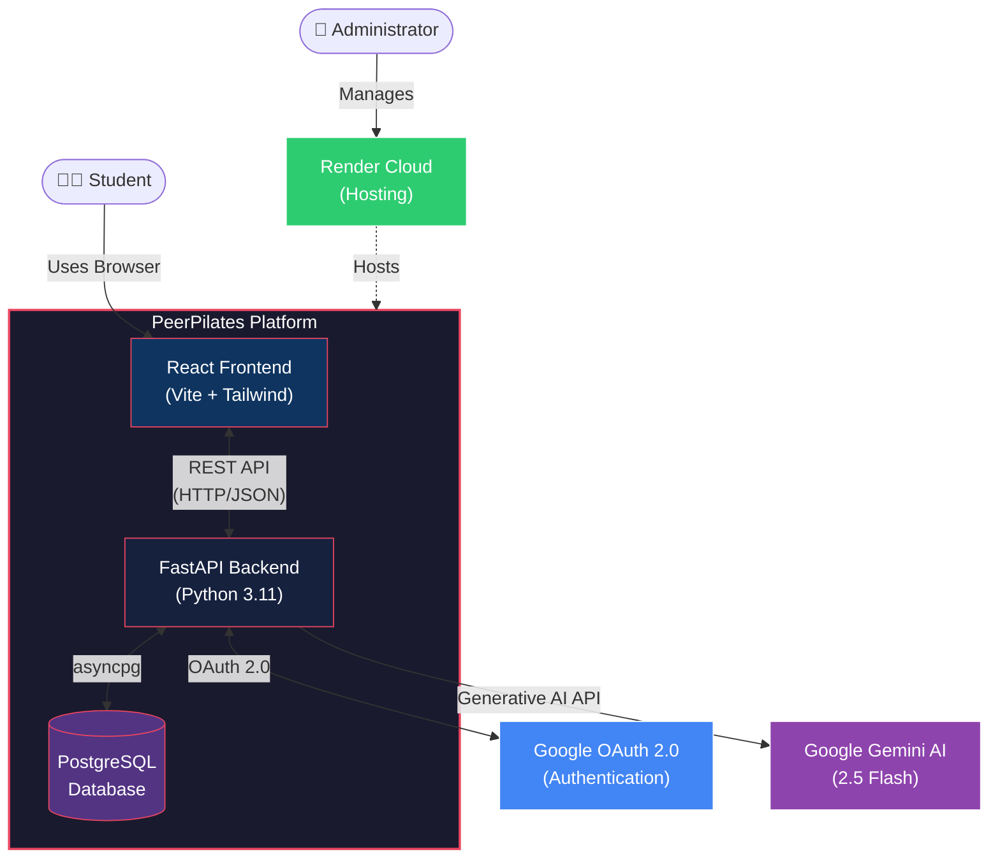
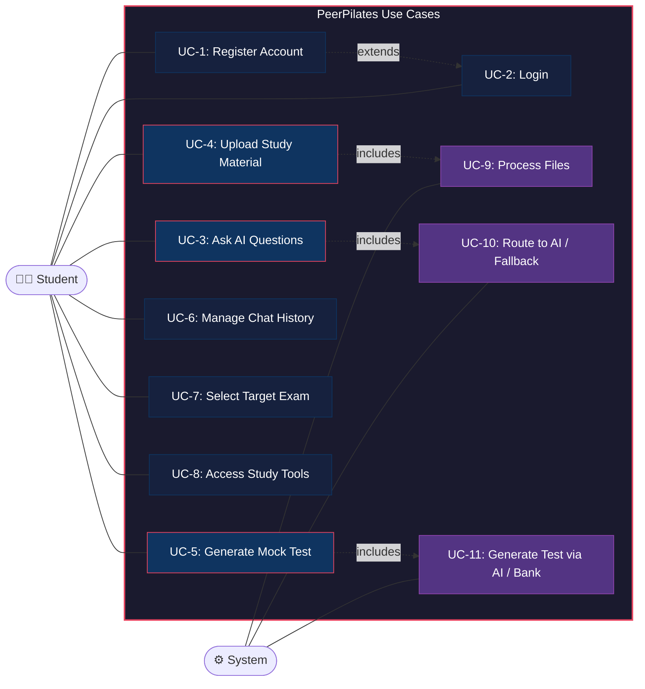
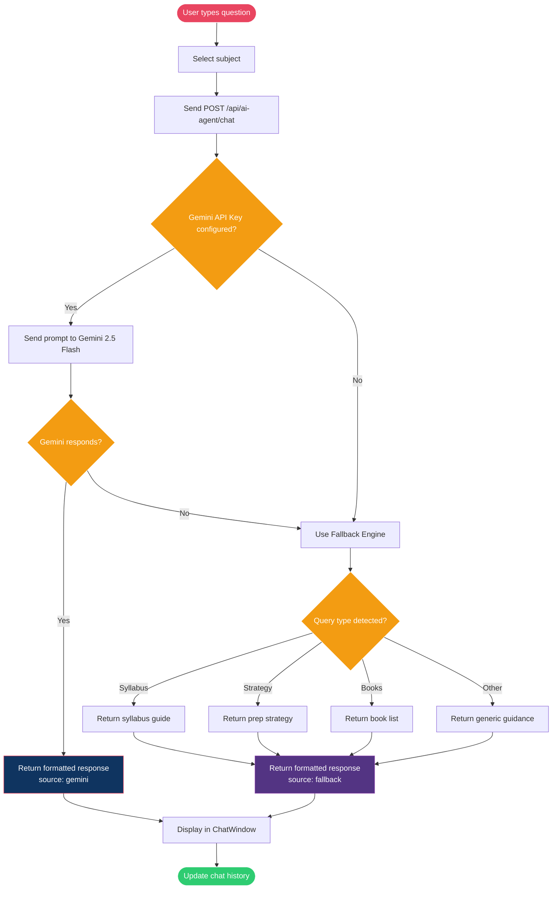
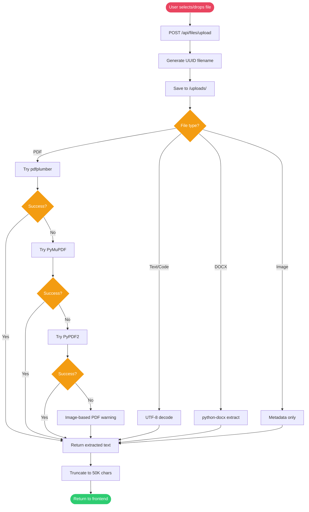
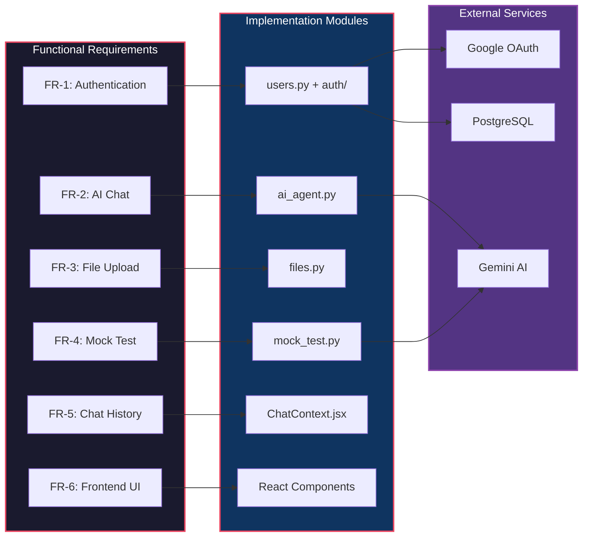

# Software Requirements Specification (SRS)

## PeerPilates — AI-Powered Government Exam Preparation Platform

| Field               | Details                                                       |
|---------------------|---------------------------------------------------------------|
| **Document Version**| 1.0                                                           |
| **Date**            | May 2026                                                      |
| **Project Name**    | PeerPilates                                                   |
| **Project Type**    | Full-Stack Web Application (AI-Powered EdTech)                |
| **Technology Stack**| FastAPI · React (Vite) · PostgreSQL · Google Gemini AI         |
| **Deployment**      | Render (Backend Web Service + Frontend Static Site + PostgreSQL)|

---

## 1. Introduction

### 1.1 Purpose
This Software Requirements Specification (SRS) document provides a complete description of the functional and non-functional requirements for PeerPilates — an AI-powered web platform designed to help students prepare for Indian government competitive examinations including UPSC, GATE, SSC, Banking, and Railways exams.

### 1.2 Scope
PeerPilates is a full-stack web application that combines an intelligent AI chat assistant, document processing capabilities, mock test generation, and study tools into a unified platform for exam preparation. The system provides personalized, subject-specific guidance using Google Gemini AI with intelligent fallback mechanisms.

### 1.3 Intended Audience
| Audience               | Relevance                                        |
|------------------------|--------------------------------------------------|
| Development Team       | Technical implementation reference                |
| Project Evaluators     | Understanding project scope and capabilities      |
| Faculty / Supervisors  | Academic review and assessment                    |
| Future Contributors    | Onboarding and feature extension                  |

### 1.4 Definitions & Acronyms

| Acronym / Term | Definition                                                    |
|----------------|---------------------------------------------------------------|
| UPSC           | Union Public Service Commission                               |
| GATE           | Graduate Aptitude Test in Engineering                         |
| SSC            | Staff Selection Commission                                    |
| OAuth          | Open Authorization (authentication protocol)                  |
| SPA            | Single Page Application                                       |
| CORS           | Cross-Origin Resource Sharing                                 |
| MCQ            | Multiple Choice Question                                      |
| ORM            | Object-Relational Mapping                                     |
| API            | Application Programming Interface                             |
| LLM            | Large Language Model                                          |

---

## 2. Overall Description

### 2.1 Product Perspective
PeerPilates is a standalone web application that integrates with external services (Google Gemini AI, Google OAuth) to deliver an intelligent exam preparation experience. It operates as a client-server architecture with a React SPA frontend communicating with a FastAPI backend via RESTful APIs.

### 2.1.1 System Context Diagram

### 2.2 Product Features (Summary)

| #  | Feature                      | Description                                                 |
|----|------------------------------|-------------------------------------------------------------|
| F1 | AI Chat Assistant            | Gemini-powered conversational agent for exam guidance        |
| F2 | Multi-Exam Support           | Specialized content for UPSC, GATE, SSC, Banking, Railways  |
| F3 | File Upload & Analysis       | PDF/TXT/DOCX processing with AI-powered content analysis    |
| F4 | Mock Test Generation         | AI-generated MCQ papers with configurable parameters        |
| F5 | User Authentication          | Email/password and Google OAuth login/signup                 |
| F6 | Chat History Management      | Persistent conversation sessions with CRUD operations       |
| F7 | Study Tools                  | Integrated exam-specific study utilities                    |
| F8 | Responsive UI                | Dark-themed, mobile-friendly ChatGPT-like interface         |

### 2.3 User Classes and Characteristics

| User Class       | Description                                              | Technical Skill |
|------------------|----------------------------------------------------------|-----------------|
| Student          | Primary user preparing for government exams              | Low to Medium   |
| Guest            | Unregistered visitor exploring the platform              | Low             |
| Administrator    | System maintainer managing deployment and configuration  | High            |

### 2.4 Operating Environment
- **Client**: Modern web browsers (Chrome, Firefox, Safari, Edge)
- **Server**: Python 3.11+ runtime on Render cloud platform
- **Database**: PostgreSQL 12+ (managed by Render)
- **External APIs**: Google Gemini AI, Google OAuth 2.0

### 2.5 Assumptions and Dependencies
1. Users have a stable internet connection.
2. Google Gemini API remains available with current quotas.
3. Google OAuth service is operational.
4. PostgreSQL database is accessible from the backend service.
5. Render hosting platform maintains uptime guarantees.

---

## 3. Functional Requirements

### 3.1 User Authentication Module

| ID      | Requirement                                                                 | Priority |
|---------|-----------------------------------------------------------------------------|----------|
| FR-1.1  | System shall allow users to register with name, email, and password         | High     |
| FR-1.2  | Passwords must be ≥ 8 characters with uppercase, number, and special char   | High     |
| FR-1.3  | System shall hash passwords using bcrypt before storage                     | High     |
| FR-1.4  | System shall prevent duplicate email registrations                          | High     |
| FR-1.5  | System shall authenticate users via email/password login                    | High     |
| FR-1.6  | System shall support Google OAuth 2.0 login flow                           | High     |
| FR-1.7  | Google OAuth shall create accounts for new users automatically (on signup)  | Medium   |
| FR-1.8  | System shall redirect to error page for unregistered Google login attempts  | Medium   |
| FR-1.9  | System shall manage user sessions using middleware                          | High     |

### 3.2 AI Chat Assistant Module

| ID      | Requirement                                                                 | Priority |
|---------|-----------------------------------------------------------------------------|----------|
| FR-2.1  | System shall accept text queries with optional subject selection             | High     |
| FR-2.2  | System shall route queries to Google Gemini 2.5 Flash model                 | High     |
| FR-2.3  | AI responses shall follow structured formatting (headings, bullets, etc.)   | Medium   |
| FR-2.4  | System shall provide fallback responses when Gemini API is unavailable      | High     |
| FR-2.5  | Fallback engine shall have pre-built knowledge for all 6 exam categories    | Medium   |
| FR-2.6  | Each response shall include 2–3 follow-up questions                         | Low      |
| FR-2.7  | System shall integrate uploaded file content into AI context                | Medium   |
| FR-2.8  | System shall support subjects: UPSC, GATE, SSC, Banking, Railways, Current Affairs | High |
| FR-2.9  | System shall provide a status endpoint reporting AI service availability    | Low      |

### 3.3 File Upload & Processing Module

| ID      | Requirement                                                                 | Priority |
|---------|-----------------------------------------------------------------------------|----------|
| FR-3.1  | System shall accept file uploads via multipart form data                    | High     |
| FR-3.2  | Supported formats: PDF, TXT, MD, DOCX, DOC, images, source code files      | High     |
| FR-3.3  | PDF extraction shall use three-tier fallback: pdfplumber → PyMuPDF → PyPDF2| High     |
| FR-3.4  | System shall extract tables from PDF documents                              | Medium   |
| FR-3.5  | Text content shall be truncated to 50,000 characters maximum               | Medium   |
| FR-3.6  | Each uploaded file shall receive a unique UUID identifier                   | High     |
| FR-3.7  | System shall provide file info retrieval and deletion endpoints             | Medium   |
| FR-3.8  | System shall return a list of supported file types via API                  | Low      |

### 3.4 Mock Test Generation Module

| ID      | Requirement                                                                 | Priority |
|---------|-----------------------------------------------------------------------------|----------|
| FR-4.1  | System shall generate MCQ-based mock test papers via Gemini AI              | High     |
| FR-4.2  | Papers shall be configurable: exam, subject, difficulty, question count, duration | High |
| FR-4.3  | Difficulty levels: Easy, Medium, Hard                                       | Medium   |
| FR-4.4  | Questions shall have 4 options labeled (A), (B), (C), (D)                  | High     |
| FR-4.5  | Optional answer key with explanations shall be includable                   | Medium   |
| FR-4.6  | Fallback question bank shall be available for offline generation            | High     |
| FR-4.7  | System shall provide subject listing per exam via API endpoint              | Medium   |
| FR-4.8  | Question mix: 40% conceptual, 35% application, 25% analysis               | Low      |

### 3.5 Chat History & Session Management

| ID      | Requirement                                                                 | Priority |
|---------|-----------------------------------------------------------------------------|----------|
| FR-5.1  | System shall persist chat conversations across sessions                     | High     |
| FR-5.2  | Users shall be able to create new chat sessions                             | High     |
| FR-5.3  | Users shall be able to view and switch between chat histories               | Medium   |
| FR-5.4  | Users shall be able to delete chat sessions                                 | Medium   |
| FR-5.5  | Chat sidebar shall display conversation list with timestamps                | Medium   |

### 3.6 Frontend User Interface

| ID      | Requirement                                                                 | Priority |
|---------|-----------------------------------------------------------------------------|----------|
| FR-6.1  | UI shall follow a ChatGPT-like dark-themed layout                           | High     |
| FR-6.2  | Interface shall include: Header, Sidebar, Chat Window, Input Bar            | High     |
| FR-6.3  | Drag-and-drop file upload with visual feedback shall be supported           | Medium   |
| FR-6.4  | Messages shall render formatted text (bold, bullets, code blocks)           | Medium   |
| FR-6.5  | Exam selection component shall allow choosing target examination            | Medium   |
| FR-6.6  | UI shall be responsive across desktop and mobile viewports                  | High     |

---

## 4. Non-Functional Requirements

### 4.1 Performance

| ID       | Requirement                                                      | Target           |
|----------|------------------------------------------------------------------|------------------|
| NFR-1.1  | API response time for chat queries (excluding AI latency)        | < 500 ms         |
| NFR-1.2  | File upload processing time for files up to 10 MB                | < 5 seconds      |
| NFR-1.3  | Concurrent user support                                          | 50+ users        |
| NFR-1.4  | Database connection pool                                         | 5 base + 10 overflow |
| NFR-1.5  | Connection recycling interval                                    | 300 seconds      |

### 4.2 Security

| ID       | Requirement                                                      |
|----------|------------------------------------------------------------------|
| NFR-2.1  | All passwords hashed with bcrypt (72-byte truncation)            |
| NFR-2.2  | API keys stored as environment variables, never in source code   |
| NFR-2.3  | CORS restricted to whitelisted frontend origins                  |
| NFR-2.4  | OAuth tokens managed via secure session middleware               |
| NFR-2.5  | SQL injection prevention via SQLAlchemy ORM parameterization     |
| NFR-2.6  | File uploads validated and sanitized                             |
| NFR-2.7  | Session secret keys auto-generated in production                 |

### 4.3 Reliability & Availability

| ID       | Requirement                                                      |
|----------|------------------------------------------------------------------|
| NFR-3.1  | AI fallback system ensures responses even when Gemini is down    |
| NFR-3.2  | Database connection pre-ping to detect and replace stale connections |
| NFR-3.3  | Three-tier PDF extraction ensures maximum compatibility          |
| NFR-3.4  | Graceful error handling with user-friendly error messages        |

### 4.4 Scalability

| ID       | Requirement                                                      |
|----------|------------------------------------------------------------------|
| NFR-4.1  | Async database operations via asyncpg for non-blocking I/O       |
| NFR-4.2  | Stateless API design enabling horizontal scaling                 |
| NFR-4.3  | Configurable database pool sizing                                |

### 4.5 Usability

| ID       | Requirement                                                      |
|----------|------------------------------------------------------------------|
| NFR-5.1  | Intuitive ChatGPT-style interface requiring no training          |
| NFR-5.2  | Formatted AI responses with clear headings and structure         |
| NFR-5.3  | Dark theme for reduced eye strain during extended study sessions  |
| NFR-5.4  | Mobile-responsive design                                         |

### 4.6 Maintainability

| ID       | Requirement                                                      |
|----------|------------------------------------------------------------------|
| NFR-6.1  | Modular backend architecture (routes, models, schemas, services) |
| NFR-6.2  | Component-based frontend architecture (React components + contexts)|
| NFR-6.3  | Environment-based configuration via .env files                   |
| NFR-6.4  | Infrastructure-as-code deployment via render.yaml                |

---

## 5. Use Cases

### 5.1 Use Case Diagram

### 5.2 Use Case: Ask AI a Question (UC-3)

| Field           | Description                                                          |
|-----------------|----------------------------------------------------------------------|
| **Actor**       | Student                                                              |
| **Precondition**| User is logged in and on the chat page                               |
| **Trigger**     | User types a message and hits Send                                   |
| **Main Flow**   | 1. User enters a question and selects a subject (e.g., UPSC)        |
|                 | 2. Frontend sends POST to `/api/ai-agent/chat`                      |
|                 | 3. Backend sends prompt to Gemini 2.5 Flash with system instructions |
|                 | 4. Gemini returns a structured response                              |
|                 | 5. Backend returns formatted response to frontend                    |
|                 | 6. Message is displayed in the chat window                           |
| **Alt Flow**    | 3a. Gemini API fails → fallback to pre-built knowledge base          |
| **Postcondition**| Response is displayed; chat history updated                         |

### 5.3 Use Case: Upload and Analyze a PDF (UC-4)

| Field           | Description                                                          |
|-----------------|----------------------------------------------------------------------|
| **Actor**       | Student                                                              |
| **Precondition**| User is logged in                                                    |
| **Trigger**     | User drags/selects a file for upload                                 |
| **Main Flow**   | 1. User selects a PDF file via drag-and-drop or file picker          |
|                 | 2. Frontend sends multipart POST to `/api/files/upload`              |
|                 | 3. Backend saves file with UUID, extracts text (pdfplumber first)    |
|                 | 4. Extracted text is returned to frontend                            |
|                 | 5. User can now ask AI questions about the uploaded content          |
| **Alt Flow**    | 3a. pdfplumber fails → PyMuPDF → PyPDF2 → "Image-based" warning     |
| **Postcondition**| File stored on server; extracted text available for AI queries       |

### 5.4 Use Case: Generate a Mock Test (UC-5)

| Field           | Description                                                          |
|-----------------|----------------------------------------------------------------------|
| **Actor**       | Student                                                              |
| **Precondition**| User is logged in                                                    |
| **Trigger**     | User selects exam, subject, difficulty and clicks Generate           |
| **Main Flow**   | 1. User configures: exam, subject, difficulty, question count, duration |
|                 | 2. Frontend sends POST to `/api/mock-test/generate`                  |
|                 | 3. Backend generates MCQ paper via Gemini AI                         |
|                 | 4. Paper with optional answer key is returned                        |
|                 | 5. Paper is displayed in a readable format in the UI                 |
| **Alt Flow**    | 3a. Gemini unavailable → fallback question bank generates paper      |
| **Postcondition**| Mock test paper displayed; optionally downloadable                  |

### 5.5 Activity Diagram: AI Chat Flow

### 5.6 Activity Diagram: File Upload & Processing

---

## 6. External Interface Requirements

### 6.1 API Endpoints Summary

| Method   | Endpoint                          | Description                   |
|----------|-----------------------------------|-------------------------------|
| POST     | `/api/signup`                     | User registration             |
| POST     | `/api/login`                      | User login                    |
| GET      | `/api/auth/google/login`          | Initiate Google OAuth         |
| GET      | `/api/auth/google/callback`       | Google OAuth callback         |
| GET      | `/api/auth/google/status`         | OAuth configuration status    |
| POST     | `/api/ai-agent/chat`              | Send message to AI            |
| GET      | `/api/ai-agent/status`            | AI service status             |
| POST     | `/api/ai-agent/test`              | Test Gemini API connectivity  |
| POST     | `/api/files/upload`               | Upload files                  |
| GET      | `/api/files/{file_id}`            | Get file information          |
| DELETE   | `/api/files/{file_id}`            | Delete uploaded file          |
| GET      | `/api/files/supported-types`      | List supported file types     |
| POST     | `/api/mock-test/generate`         | Generate mock test paper      |
| GET      | `/api/mock-test/subjects/{exam}`  | Get subjects for an exam      |

### 6.2 Third-Party Integrations

| Service            | Purpose                        | Protocol      |
|--------------------|--------------------------------|---------------|
| Google Gemini AI   | AI chat responses & test gen   | REST API      |
| Google OAuth 2.0   | Social authentication          | OAuth 2.0     |
| PostgreSQL         | Persistent data storage        | TCP (asyncpg) |
| Render             | Cloud hosting & deployment     | HTTPS         |

---

## 7. System Constraints

1. **Gemini API Quota**: Subject to Google's rate limits and usage quotas.
2. **Free Tier Limitations**: Render free tier may cause cold-start delays (~30s).
3. **File Size**: Uploaded files are limited to server memory constraints.
4. **Bcrypt Limitation**: Passwords truncated to 72 bytes before hashing.
5. **PDF OCR**: Scanned/image-based PDFs cannot be extracted (no OCR support).

---

## 8. Appendix

### 8.1 Technology Stack Summary

| Layer        | Technology                                      |
|--------------|-------------------------------------------------|
| Frontend     | React 19, Vite 7, Tailwind CSS 3                |
| Backend      | Python 3.11, FastAPI, Uvicorn                   |
| Database     | PostgreSQL (asyncpg + SQLAlchemy 2.0)           |
| AI Engine    | Google Gemini 2.5 Flash                         |
| Auth         | bcrypt, Authlib (OAuth), Starlette Sessions     |
| File Parsing | pdfplumber, PyMuPDF, PyPDF2                     |
| Deployment   | Render (render.yaml Blueprint)                  |
| Version Ctrl | Git + GitHub                                    |

### 8.2 Requirement Traceability Map

---

*End of SRS Document*
